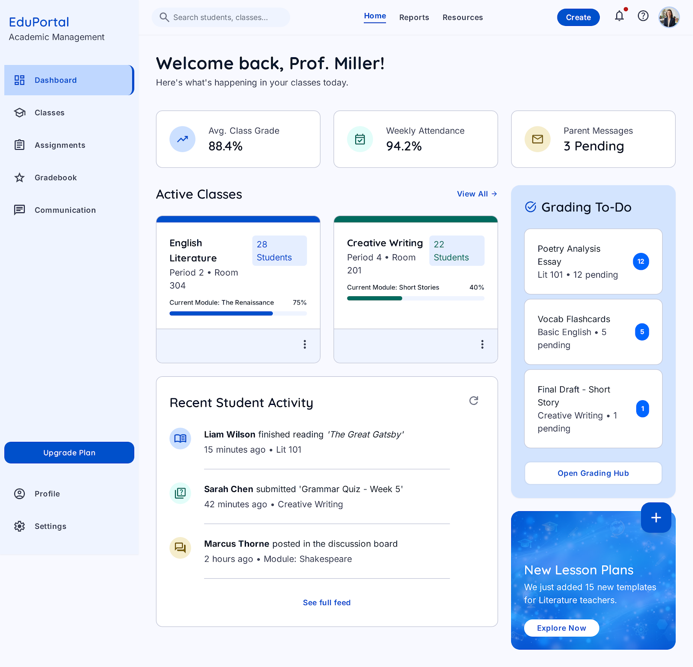
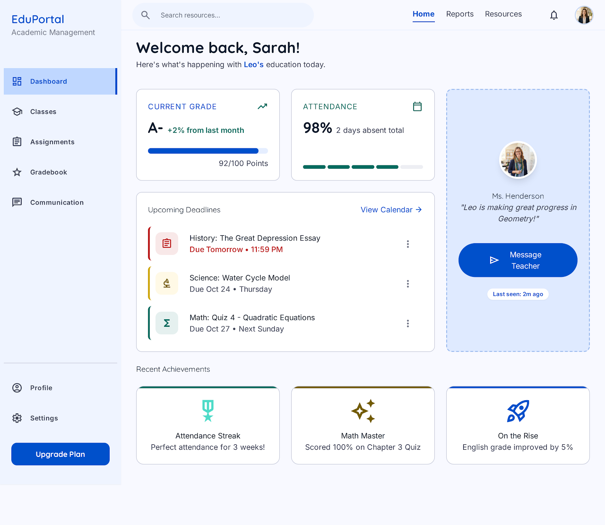
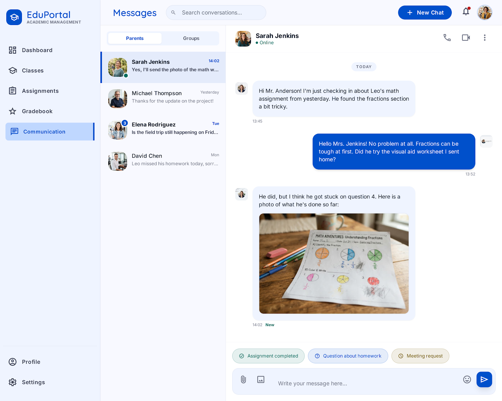

# EduConnect Interactive Portal


An operational multi-tenant educational web application foundation. It includes state, district, and school administration views, LMS tools, student missions, teacher workflows, parent views, messaging, community board approvals, local persistence, and an optional Node API server for shared backend state.

All bundled people and records are synthetic demo data. Do not commit real student records; complete the [privacy and FERPA production checklist](docs/PRIVACY-FERPA.md) before onboarding a school.

## Features

- Separate State Admin, District Admin, School Admin, Teacher, Parent, and Student workspaces
- State, district, and school hierarchy with tenant selectors and compliance oversight
- LMS dashboard with assignments, offline packs, guardrails, notifications, and account switching
- Student mission completion with points and awards
- Teacher class filtering, assignment creation, activity refresh, and reply flows
- Parent progress dashboard and teacher messaging entry points
- Communication hub with work-hour restrictions and emergency override
- Community board submission, approver assignment, approval, rejection, and publishing
- Search, notifications, settings, compact mode, high-contrast mode, and demo state export
- Demo authentication for State Admin, District Admin, School Admin, Teacher, Parent, and Student
- Role-aware permissions for tenant management, LMS controls, emergency override, and post approval
- Tenant-scoped account visibility for state, district, school, guardian, and student users
- Authenticated live API writes, file uploads/downloads, notification tests, backups, and user management
- Guided onboarding walkthrough for the main workflows
- JSON import/export for portable demo state
- Mock API mode backed by a local service abstraction
- Server database mode backed by `server.mjs` and persistent JSON storage
- Local persistence through `localStorage` for offline/demo fallback

## Screenshots







## Local Preview

```powershell
npm install
npm run dev
```

Open the local URL Vite prints, usually `http://127.0.0.1:5173/`.

## Fully Operational Local App

Run the real web application with a backend API and shared server-side persistence:

```powershell
npm install
npm run build
npm start
```

Open `http://127.0.0.1:8080/`, then switch **Data mode** to **Server database**. The app will use these API endpoints:

- `GET /api/health`
- `GET /api/state`
- `PUT /api/state`
- `POST /api/reset`
- `POST /api/login`
- `GET /api/session`
- `GET /api/users`
- `POST /api/users`
- `PATCH /api/users/:id`
- `POST /api/password/change`
- `POST /api/password/reset`
- `GET /api/files`
- `POST /api/files`
- `GET /api/files/:id/download`
- `GET /api/notification-provider`
- `PUT /api/notification-provider`
- `GET /api/backups`
- `POST /api/backups`

Server data is stored in `data/educonnect-state.json`, which is ignored by git. Set `PORT`, `DATA_DIR`, or `PUBLIC_DIR` in the environment to change runtime paths.
Operational accounts are stored in `data/educonnect-accounts.json`, uploaded files in `data/uploads/`, and backups in `data/backups/`.

## Demo Logins

Use the **Signed in as** panel to switch between:

- State Admin: statewide governance, compliance, tenant oversight, emergency, and approval access
- District Admin: district operations, school tenants, LMS, messaging, emergency, and approval access
- School Admin: campus operations, school users, LMS, messaging, and approval access
- Teacher: LMS, assignment, messaging, and post submission access
- Parent: messaging and community submission access
- Student: student mission access

Restricted actions remain visible but disabled with an explanatory permission note.

Server-database credentials are never stored in source control. Initial account passwords must be supplied through the `EDUCONNECT_BOOTSTRAP_*` environment variables documented in `.env.example`; every account should receive a unique password and rotate it at first sign-in.

Admin accounts can create users, disable accounts, reset passwords, configure notification providers, and create backups through the API. State admins see state-scoped accounts, district admins see district-scoped accounts, and school admins see only their school tenant.

## Demo State

Open Settings in the top bar to:

- Export demo state as `educonnect-demo-state.json`
- Import a previously exported state file
- Switch between local demo persistence, mock API mode, and server database mode
- Toggle compact density and high-contrast panels

Mock API mode uses `src/mockApi.js`, which simulates async reads/writes while keeping the app fully local.
Server database mode uses `server.mjs`, which persists shared state through HTTP API routes.

## Build

```powershell
npm run build
```

The production build is written to `dist/`.

## Tests

```powershell
npm test
```

The test suite runs Playwright UI coverage plus Node API tests. It covers navigation, LMS actions, messaging, community approvals, search, settings, reset, backend health, state persistence, and basic role sessions.

## GitHub Pages

This repository includes `.github/workflows/pages.yml`. After pushing to `main`, enable GitHub Pages with **Source: GitHub Actions** in the repository settings. The workflow builds the Vite app and deploys `dist/`.

Setup steps:

1. Push `main` to GitHub.
2. Open the repository on GitHub.
3. Go to **Settings**.
4. Open **Pages**.
5. Set **Source** to **GitHub Actions**.
6. Run or wait for the `Deploy to GitHub Pages` workflow.
7. Open the deployment URL shown in the workflow summary.

## Hostinger Deployment

This app can also be deployed to a Hostinger subdomain as a static site.

```powershell
npm run build:hostinger
Compress-Archive -Path .\dist\* -DestinationPath .\deploy\educonnect-hostinger.zip -Force
```

See `HOSTINGER_DEPLOY.md` for the detected Hostinger target and upload steps.

Automated SFTP deploy is also available after creating a local `.env` file:

```powershell
npm run deploy:hostinger
```

Live smoke test:

```powershell
$env:LIVE_BASE_URL="https://educationalsystem.fieldserviceit.com"
npm run test:live
```

The FTP deployment is static only. To run the fully operational server-backed version on Hostinger, use a Hostinger VPS or Node.js-capable hosting plan, then run `npm run build` and `npm start` with `PORT` configured by the host. If only shared FTP hosting is available, keep using the static build and connect the frontend to an external hosted API/database.

For production, put the Node app behind HTTPS, back up the `data/` directory nightly, and set environment-specific storage paths with `DATA_DIR`.

## Data Boundary

Mock records live behind `src/dataSource.js`. The current implementation re-exports local demo data, so future API work can replace that boundary without rewriting the UI renderers.
